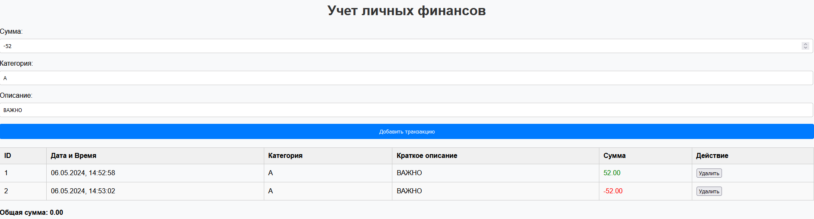

# Учет личных финансов

## Инструкции по запуску проекта

1. Скачайте все файлы проекта.
2. Откройте файл `index.html` в любом современном веб-браузере.

## Описание индивидуальной работы

Этот проект был создан для учета личных финансов. Он предоставляет возможность добавления транзакций, их удаления и подсчета общей суммы.

## Краткая документация к проекту

### Функциональность

1. **Добавление транзакций:** Заполните форму суммы, категории и описания транзакции, затем нажмите кнопку "Добавить транзакцию".
2. **Удаление транзакций:** Нажмите кнопку "Удалить" рядом с транзакцией в таблице.
3. **Подсчет общей суммы:** Общая сумма транзакций автоматически пересчитывается после добавления или удаления транзакции.
4. **Отображение подробной информации:** При клике на строку с транзакцией в таблице отображается полное описание транзакции.

## Примеры использования проекта

1. **Добавление транзакции:**
   
   

2. **Удаление транзакции:**
   
   

3. **Подробное описание транзакции:**
   
   

## Ответы на контрольные вопросы

1. **Каким образом можно получить доступ к элементу на веб-странице с помощью JavaScript?**
   - С помощью метода `document.getElementById()` по идентификатору элемента.
   - С помощью метода `document.querySelector()` с CSS-селектором.
   - С помощью методов `document.getElementsByClassName()` или `document.getElementsByTagName()` по классу или тегу элемента соответственно.

2. **Что такое делегирование событий и как оно используется для эффективного управления событиями на элементах DOM?**
   - Делегирование событий - это прием, при котором обработчик событий устанавливается на общего предка целевых элементов, и события от дочерних элементов обрабатываются в этом общем предке.
   - Это позволяет эффективно управлять событиями на большом количестве элементов, так как обработчик устанавливается только один раз, и не требуется устанавливать его на каждый отдельный элемент.

3. **Как можно изменить содержимое элемента DOM с помощью JavaScript после его выборки?**
   - С помощью свойства `textContent` или `innerHTML`.
   - Например, `element.textContent = 'Новый текст';` или `element.innerHTML = '
Новый HTML
';`.

4. **Как можно добавить новый элемент в DOM дерево с помощью JavaScript?**
   - С помощью метода `appendChild()`, чтобы добавить элемент в конец родительского элемента.
   - С помощью метода `insertBefore()`, чтобы добавить элемент перед указанным элементом.

## Список использованных источников

- Документация Mozilla Developer Network (MDN) по JavaScript и DOM.
- Учебные материалы и примеры с сайтов, таких как W3Schools и CSS-Tricks.

